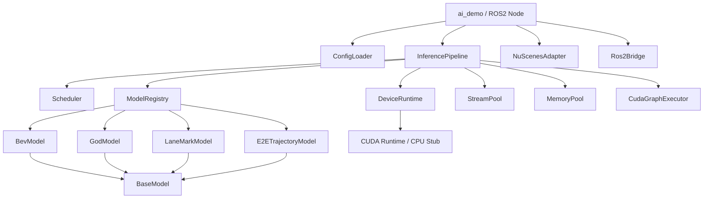
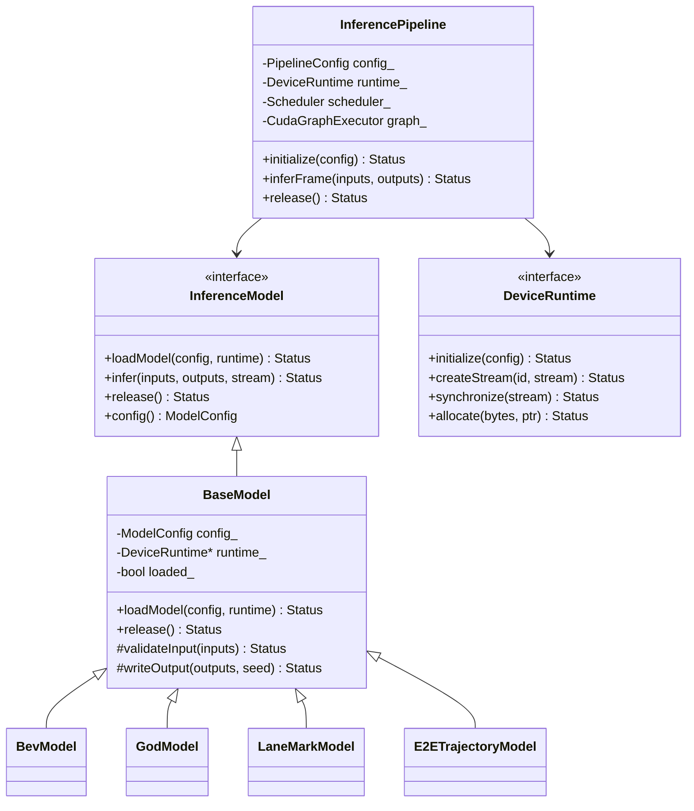
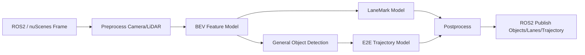
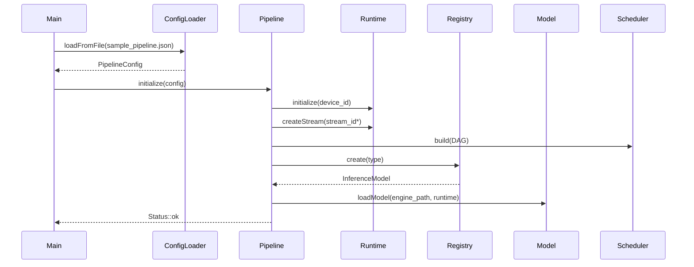
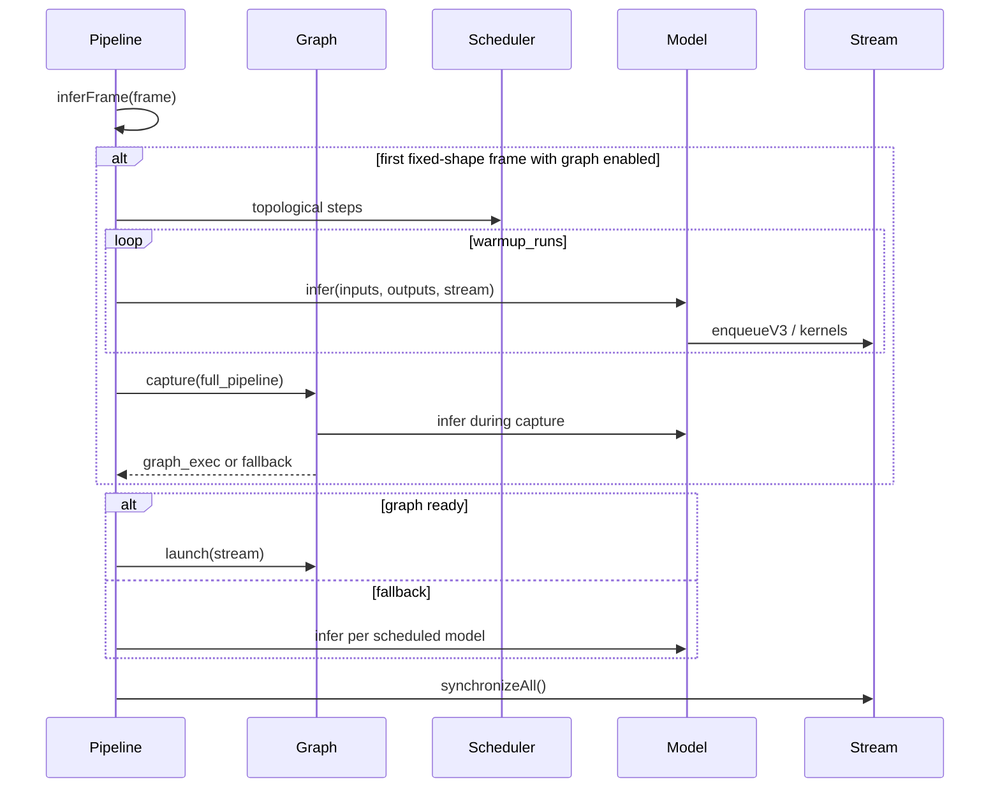

# AutonomousInference 软件设计文档

## 1. 目标与边界

本框架面向自动驾驶量产推理部署，重点解决多模型统一接入、CUDA/TensorRT 异步执行、CUDA Graph capture、资源预算调度、nuScenes/ROS2 数据边界和可测试工程化。当前代码提供可编译的 CPU stub 与清晰的 GPU 扩展点；在 NVIDIA GPU 环境打开 `AI_ENABLE_CUDA`、`AI_ENABLE_TENSORRT`、`AI_ENABLE_ROS2` 后可接入真实推理后端。

## 2. 开源实践整理

| 来源 | 可借鉴实践 | 设计落点 |
| --- | --- | --- |
| NVIDIA TensorRT 性能文档 | batching、within/cross inference multi-streaming、`enqueueV3()` CUDA Graph capture、动态 shape capture 限制、timing cache | 每模型独立 stream/context；固定 shape 预热后 capture；动态 shape 按 profile 建 graph；构建期保存 timing cache |
| NVIDIA CUDA Graphs | graph 降低 CPU launch overhead；capture 期间避免同步 API/default stream | `CudaGraphExecutor` 使用 non-blocking stream，capture 失败自动 fallback |
| Autoware `autoware_tensorrt_common` | ONNX/engine 加载、IO shape 校验、profile dims、profiling utilities | `ModelConfig` 显式声明 input/output tensor 与 shape，模型 load 阶段校验 |
| Autoware BEVFormer/BEVFusion | ROS2 perception node、TensorRT 推理、多传感器融合、nuScenes 训练模型 | `NuScenesAdapter` + `Ros2Bridge` 分离数据适配与通信接口 |
| Apollo perception/Apollo Vision Net Deployment | 自动驾驶感知多模型 TensorRT 部署、BEV/OCC pipeline | BEV -> GOD/LaneMark -> E2E 的 DAG pipeline 与模型注册机制 |

## 3. 模块依赖图

## 4. 类关系图

## 5. 帧级流程图

## 6. 初始化时序图

## 7. 推理与 CUDA Graph 时序图

## 8. 性能设计方案

### 8.1 CUDA 与 stream 策略

- 每个模型配置 `stream_id`，BEV 使用主 stream，GOD/LaneMark 可共享或拆分辅助 stream，E2E 等待 GOD 输出。
- CUDA stream 使用 `cudaStreamNonBlocking`，避免 graph capture 期间 default stream 隐式同步。
- TensorRT 后端中每个 engine 至少一个 execution context；跨模型并发时使用独立 context + stream。
- 对延迟敏感链路优先保证 BEV/E2E；对吞吐敏感链路允许 GOD/LaneMark 与后处理 overlap。

### 8.2 CUDA Graph capture 策略

- 固定 shape/profile：启动后先执行一次或多次 warmup，刷新 TensorRT 内部状态，再 capture 完整 pipeline。
- 动态 shape：按 `{model, optimization_profile, input_shape}` 建 graph cache；shape 变化时先普通 enqueue，再尝试 capture 新 graph。
- capture 失败：保留普通 stream enqueue 路径，不影响功能，只降低 launch 开销优化收益。
- capture 期间禁止同步拷贝和 default stream kernel；所有 H2D/D2H 使用 async API。

### 8.3 显存与 workspace 设计

- 配置 `memory_pool_bytes` 为模型输入、输出、workspace 和 activation buffer 预留连续池。
- `estimated_workspace_bytes` 用于启动期预算检查：总预算超过设备上限时拒绝启动或降级模型组合。
- TensorRT 推荐使用 engine/context 外部 device memory，让 graph capture 固化地址且避免运行期分配。
- 多模型共享 tensor 采用引用计数或生命周期区间分析；BEV feature 在 GOD/LaneMark 完成后释放。

### 8.4 调度设计

- Pipeline 由 DAG 表达依赖，`Scheduler` 先拓扑排序，再按 priority 对同层 ready 节点排序。
- 量产调度器可扩展为 EDF/优先级队列：感知输出 deadline、轨迹 deadline、模型算力预算与降级策略共同参与决策。
- 资源冲突策略：同一 stream 内严格顺序，不同 stream 通过 CUDA event 显式同步依赖边。
- 降级策略：GPU 过载时保留 BEV + E2E 主链路，降低 LaneMark 频率或 GOD 类别数量。

### 8.5 算子优化封装

- 矩阵乘法默认走 cuBLASLt/TensorRT fused tactics，CPU stub 仅用于测试。
- 卷积、池化优先交给 TensorRT/cuDNN fusion；自定义算子以 plugin 方式接入。
- 后处理 NMS、decode、坐标变换应 CUDA kernel 化并纳入 graph capture。

## 9. ROS2 与 nuScenes 数据接口

- nuScenes frame 包含 sample token、timestamp、六路 camera image、LiDAR path、标定与 ego pose。
- ROS2 输入建议订阅 `sensor_msgs/Image`、`sensor_msgs/PointCloud2`、TF 与 ego motion；输出发布 objects、lane markers、trajectory/path。
- 框架内以 `Tensor`/`TensorMap` 作为模型边界，ROS2 与 nuScenes 仅在 adapter 层转换，避免模型实现依赖通信中间件。

## 10. 测试策略

- `test_config` 验证 JSON 配置解析、shape 与模型字段。
- `test_pipeline` 验证 DAG 调度、BEV 首节点约束、四模型输出和 graph fallback/stub 路径。
- GPU 环境扩展测试应覆盖 TensorRT engine 加载、CUDA stream 同步、graph capture 成功与 fallback、ROS2 topic publish。
